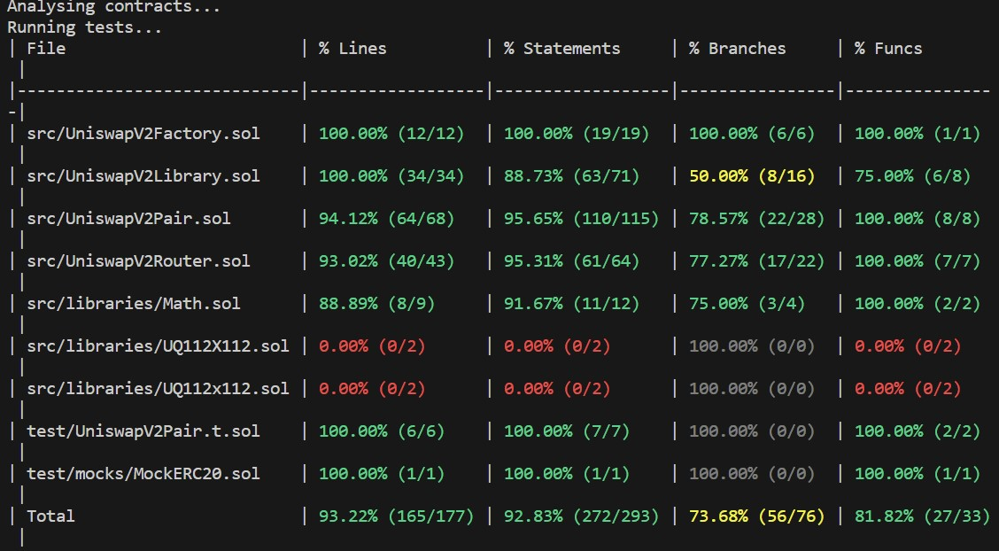

UniswapV2 was written three years ago and uses outdated versions of Solidity tools
## Project goals:
1. Achieve deep knowledge of the UniswapV2 implementation
2. Learn Foundry, the next generation ethereum development environment
3. use any online resources for the project.
4. Read through the UniswapV2 code:
https://github.com/Uniswap/v2-core
https://github.com/Uniswap/v2-periphery
5. Copy the UniswapV2 code into a new Foundry project
6. The original code had the core and periphery contracts in different repos. We recommend combining them into a single repo to simplify development, and copying libraries rather than using package management.
UniswapV2Router01 should not be included.
7. Upgrade the UniswapV2 code to the latest Solidity version that Foundry supports.
8. Write Solidity tests with line coverage for each of the following contracts:
UniswapV2Router02
UniswapV2Pair
UniswapV2Factory
9. Generate and commit a line coverage report to assess the quality of your tests

